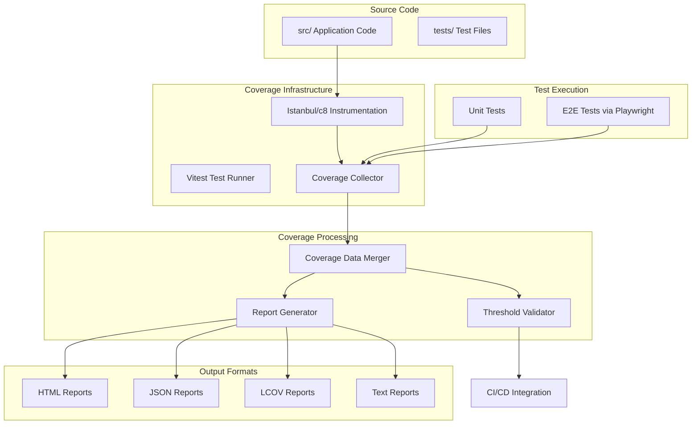

# Design Document: Code Coverage Reporting

## Overview

This design document outlines the implementation of comprehensive code coverage reporting for the JSON-CSV merge tool application. The system will integrate with the existing Vite + React + TypeScript stack and Playwright E2E testing infrastructure to provide detailed coverage metrics, enforce quality thresholds, and support multiple output formats for different use cases.

The coverage system will leverage Vitest's built-in coverage capabilities (powered by Istanbul/c8) to instrument source code, collect execution data during both unit and E2E tests, and generate comprehensive reports. This approach ensures minimal performance impact while providing accurate coverage metrics across the entire application.

## Architecture

### High-Level Architecture



### Component Integration

The coverage system integrates with existing infrastructure:

- **Vite Configuration**: Extended to support coverage collection during development and testing
- **Playwright Tests**: Enhanced to collect coverage from the running application
- **CI/CD Pipeline**: Integrated to enforce thresholds and generate artifacts
- **Development Workflow**: Seamlessly integrated without disrupting existing processes

## Components and Interfaces

### Core Components

#### 1. Coverage Configuration Manager
**Purpose**: Centralized configuration for all coverage settings
**Location**: `vitest.config.ts` and dedicated coverage configuration

```typescript
interface CoverageConfig {
  provider: 'istanbul' | 'c8';
  reporter: string[];
  reportsDirectory: string;
  exclude: string[];
  include: string[];
  thresholds: CoverageThresholds;
  all: boolean;
  clean: boolean;
}

interface CoverageThresholds {
  global: ThresholdConfig;
  perFile?: ThresholdConfig;
  patterns?: Record<string, ThresholdConfig>;
}

interface ThresholdConfig {
  lines: number;
  functions: number;
  branches: number;
  statements: number;
}
```

#### 2. Test Integration Layer
**Purpose**: Coordinates coverage collection across different test types
**Responsibilities**:
- Unit test coverage collection via Vitest
- E2E test coverage collection via Playwright
- Coverage data merging and consolidation

#### 3. Report Generation Engine
**Purpose**: Produces coverage reports in multiple formats
**Outputs**:
- HTML reports for interactive browsing
- JSON reports for programmatic analysis
- LCOV reports for external tool integration
- Text reports for quick terminal viewing

#### 4. Threshold Enforcement System
**Purpose**: Validates coverage against configured thresholds
**Features**:
- Global coverage thresholds
- Per-file coverage thresholds
- Pattern-based threshold configuration
- CI/CD integration for build failures

### Interface Definitions

#### Coverage Data Interface
```typescript
interface CoverageData {
  files: Record<string, FileCoverage>;
  totals: CoverageSummary;
  timestamp: string;
  testType: 'unit' | 'e2e' | 'merged';
}

interface FileCoverage {
  path: string;
  lines: LineCoverage;
  functions: FunctionCoverage;
  branches: BranchCoverage;
  statements: StatementCoverage;
}

interface CoverageSummary {
  lines: CoverageMetric;
  functions: CoverageMetric;
  branches: CoverageMetric;
  statements: CoverageMetric;
}

interface CoverageMetric {
  total: number;
  covered: number;
  percentage: number;
}
```

## Data Models

### Coverage Configuration Model
The system uses a hierarchical configuration model that supports:
- Global defaults
- Environment-specific overrides
- File pattern-based rules
- Test type-specific settings

### Coverage Data Model
Coverage data follows the Istanbul standard format, ensuring compatibility with existing tools and CI/CD systems. The model supports:
- Line-by-line execution tracking
- Function call tracking
- Branch coverage for conditional logic
- Statement execution tracking

### Report Model
Reports are generated in standardized formats:
- **HTML**: Interactive browsing with syntax highlighting
- **JSON**: Machine-readable format for automation
- **LCOV**: Industry standard for tool integration
- **Text**: Human-readable terminal output

## Correctness Properties

*A property is a characteristic or behavior that should hold true across all valid executions of a system—essentially, a formal statement about what the system should do. Properties serve as the bridge between human-readable specifications and machine-verifiable correctness guarantees.*
### Property Reflection

After analyzing all acceptance criteria, several properties can be consolidated to eliminate redundancy:

**Consolidation Decisions:**
- Properties 5.1-5.4 (exclusion of different file types) can be combined into a single comprehensive exclusion property
- Properties 2.1-2.4 (different coverage metrics in reports) can be combined into a single comprehensive reporting property
- Properties 6.2, 6.4, 6.5 (JSON, LCOV format compliance) can be combined into a single format compliance property
- Properties 9.1-9.3 (performance characteristics) can be combined into a single performance property

**Correctness Properties:**

Property 1: Source code instrumentation
*For any* source file in the src directory, when coverage is enabled, the file should be instrumented to track execution during tests
**Validates: Requirements 1.2, 1.3**

Property 2: File exclusion compliance
*For any* file matching exclusion patterns (test files, configuration files, build artifacts, node_modules), the file should not appear in coverage metrics
**Validates: Requirements 1.4, 5.1, 5.2, 5.3, 5.4, 5.5**

Property 3: Multi-format report generation
*For any* coverage run, reports should be generated in all configured formats (HTML, JSON, text, LCOV) with valid structure
**Validates: Requirements 1.5, 6.2, 6.4, 6.5**

Property 4: Comprehensive coverage metrics
*For any* coverage report, it should contain line, branch, function, and statement coverage percentages for each included source file
**Validates: Requirements 2.1, 2.2, 2.3, 2.4**

Property 5: Threshold enforcement
*For any* configured coverage threshold, builds should fail when coverage falls below the threshold, with appropriate error messages
**Validates: Requirements 3.1, 3.2, 3.3, 3.4, 3.5, 7.2**

Property 6: Multi-test-type coverage collection
*For any* combination of unit and E2E tests, coverage data should be collected from all test executions and merged into a unified report
**Validates: Requirements 4.1, 4.2, 4.3, 4.4**

Property 7: Coverage gap identification
*For any* uncovered code (lines, branches, functions), the coverage report should clearly identify and highlight the uncovered sections
**Validates: Requirements 8.2, 8.3, 8.4**

Property 8: Performance efficiency
*For any* test execution with coverage enabled, the performance impact should be within acceptable limits compared to running without coverage
**Validates: Requirements 9.1, 9.2, 9.3, 9.4, 9.5**

Property 9: Dynamic code inclusion
*For any* new or modified source file, it should be automatically included in coverage calculations without manual configuration
**Validates: Requirements 10.1, 10.2**

Property 10: Coverage change tracking
*For any* change in coverage percentage, the system should accurately report which files gained or lost coverage
**Validates: Requirements 10.3, 10.4**

## Error Handling

### Coverage Collection Errors
- **Instrumentation Failures**: Graceful degradation when source files cannot be instrumented
- **Test Execution Errors**: Continue coverage collection even when individual tests fail
- **Memory Limitations**: Implement streaming and chunking for large codebases
- **File System Errors**: Handle missing files, permission issues, and disk space constraints

### Report Generation Errors
- **Format Validation**: Validate report formats before writing to ensure compliance
- **Output Directory Issues**: Create directories as needed, handle permission errors
- **Large Report Handling**: Implement pagination and compression for large reports
- **Concurrent Access**: Handle multiple processes attempting to generate reports simultaneously

### Threshold Validation Errors
- **Configuration Errors**: Validate threshold configurations and provide clear error messages
- **Calculation Errors**: Handle edge cases like division by zero, missing coverage data
- **CI/CD Integration**: Ensure proper exit codes and error reporting for build systems

### Integration Errors
- **Vitest Integration**: Handle version compatibility issues and configuration conflicts
- **Playwright Integration**: Manage browser instrumentation and data collection failures
- **File System Monitoring**: Handle file watching errors and permission issues

## Testing Strategy

### Dual Testing Approach

The code coverage reporting system requires both unit testing and property-based testing to ensure comprehensive validation:

**Unit Testing Approach:**
- Test specific configuration scenarios and edge cases
- Validate report format compliance with known examples
- Test error handling with specific failure conditions
- Verify CI/CD integration with mock environments
- Test threshold enforcement with predetermined coverage values

**Property-Based Testing Approach:**
- Use **fast-check** (already available as a dev dependency) for property-based testing
- Configure each property-based test to run a minimum of 100 iterations
- Each property-based test must be tagged with a comment referencing the design document property
- Tag format: `**Feature: code-coverage-reporting, Property {number}: {property_text}**`

**Property-Based Test Requirements:**
- Property 1: Generate random source files and verify instrumentation works correctly
- Property 2: Generate random file patterns and verify exclusion rules are applied
- Property 3: Generate random coverage data and verify all report formats are valid
- Property 4: Generate random code structures and verify all coverage metrics are calculated
- Property 5: Generate random threshold configurations and verify enforcement works
- Property 6: Generate random test combinations and verify coverage merging works
- Property 7: Generate random code with gaps and verify identification works
- Property 8: Generate random test loads and verify performance stays within bounds
- Property 9: Generate random code changes and verify automatic inclusion works
- Property 10: Generate random coverage changes and verify change tracking works

**Testing Infrastructure:**
- Integrate with existing Vitest setup for unit tests
- Create test utilities for coverage data generation and validation
- Implement mock file systems for testing file operations
- Create performance benchmarking utilities for property testing
- Set up CI/CD testing environments for integration validation

## Implementation Considerations

### Technology Stack Integration
- **Vitest Configuration**: Extend existing Vite configuration to support coverage
- **Istanbul/c8 Integration**: Leverage Vitest's built-in coverage providers
- **Playwright Enhancement**: Add coverage collection to existing E2E test setup
- **TypeScript Support**: Ensure full TypeScript compatibility and type safety

### Performance Optimization
- **Selective Instrumentation**: Allow targeting specific files or directories
- **Lazy Loading**: Load coverage tools only when needed
- **Caching**: Cache instrumentation results to improve subsequent runs
- **Parallel Processing**: Support parallel test execution with coverage collection

### Development Workflow Integration
- **Watch Mode**: Support coverage collection in development watch mode
- **IDE Integration**: Ensure compatibility with VS Code and other IDEs
- **Git Integration**: Support coverage comparison across branches and commits
- **Developer Experience**: Minimize configuration overhead and provide sensible defaults

### Scalability Considerations
- **Large Codebases**: Handle projects with thousands of files efficiently
- **Memory Management**: Implement streaming for large coverage datasets
- **Report Size**: Optimize report generation for large applications
- **CI/CD Performance**: Minimize impact on build times in continuous integration

This design provides a comprehensive foundation for implementing robust code coverage reporting that integrates seamlessly with the existing JSON-CSV merge tool infrastructure while providing the flexibility and performance needed for ongoing development.